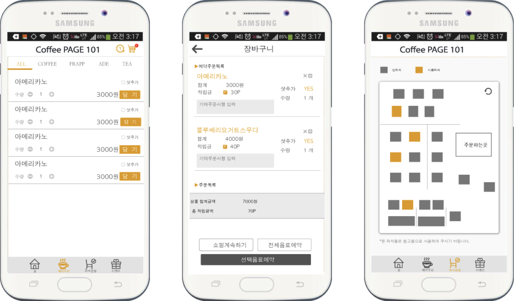

### 비 프랜차이즈 카페를 위한 커피 주문/결제 및 마케팅 플랫폼 개발 

- IITP 주관 2015 소상공인 재능기부 챌린지 우수상 수상작, 2015.05 ~ 2015.11 

- Overview                           

  - 대학교 상권 내 개인 카페를 위한 온라인 주문/결제 및 마케팅 플랫폼 개발

  - 카운터, 사용자, 테이블 어플리케이션으로 구성되며 사용자가 음료 주문/결제 시 카운터 어플리케이션으로 주문 사항 전달

    - 카운터 어플리케이션에서 설정한 신메뉴나 이벤트 등 마케팅 요소를 사용자, 테이블 어플리케이션에 노출하는 알림 기능 구현
  - 대학교 상권 특성에 맞춰 카페 내 빈 자리 확인 기능 제공

- Contribution          

  - 고객용 어플리케이션의 주문/결제 시스템 및 마케팅 알림 기능 개발          

- System Architecture and User Application UI 		

  

  

- Used Skills                       
  \#Android #GCM(Google Cloud Message) 